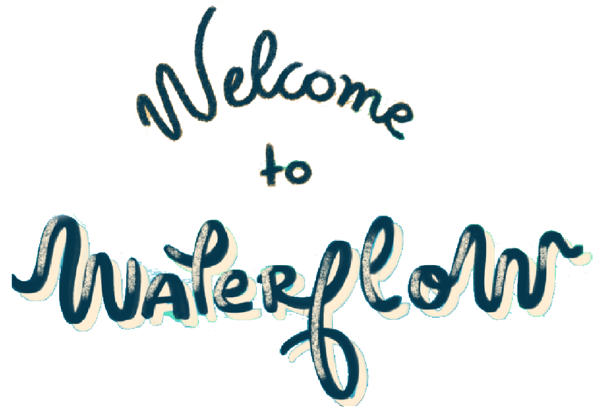

<h1 align="center">
  
</h1>
 
 

  

## 💻 Languages and Tools Used

      

## About 💬

**Water floW** is an interactive game that aims to provide learning for children up to 12 years old. With a user-friendly and easy-to-understand interface, the proposal is to present quizzes that, when answered correctly, reward the player, and when answered incorrectly, help the player learn, creating a comfortable environment that allows young people to gain knowledge quickly and enjoyably, while understanding the consequences of correct and incorrect use of water in our daily lives. It demonstrates how their choices impact their lives, whether in everyday activities, industry, and also directly affect the climate.

 *  _Try out [HERE](water-flow-phi.vercel.app)_

 *  _Video Demo [HERE]()_

## Future Work 🛠

This was a prototype after all! There is still a lot of room for improvement. 
We intend to expand even further the app's features by pulling the quiz contents from official scientific and educational sources.
We shall add support for more languages and release mobile versions of the game.

Had other cool idea that we haven't mentioned here? [Contact us](https://www.spaceappschallenge.org/2023/find-a-team/brasa/?tab=members)!

## See ya! 🔖

[We all](https://www.spaceappschallenge.org/2023/find-a-team/brasa/?tab=members) can't even express how grateful we are for participating
in this event. We've learned a lot and had tons of laughs, it was a unique experience that allowed our growth far beyond what we expected.

To anyone who has read this far, thank you for tuning in! We will see you in the next Hackathon! 

